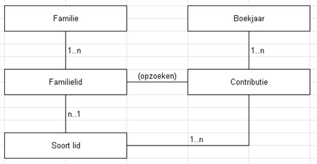
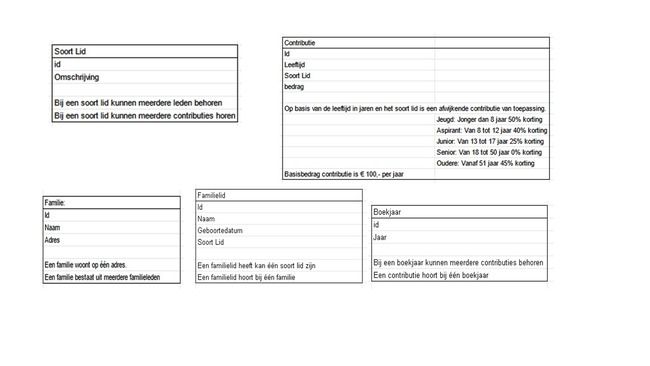

# Ledenadministratie

Voor een vereniging is het belangrijk om de contributie per gezin te kunnen inzien of vaststellen. Hiermee kan de secretaris de leden bijhouden en kan de penningmeester de contributie voor het gezin bepalen.

De applicatie begint met een overzicht van de families met daarachter het berekende bedrag aan contributie. Per familie kunnen de familieleden onderhouden worden, voor beide tabellen uiteraard via de welbekende CRUD-operaties.

Daarnaast kunnen de soorten leden en de verschillende staffels voor de contributie onderhouden worden via de CRUD-operaties.

De database zal er ongeveer zo uitzien. De relaties zijn verplicht.

**Relaties ledenadministratie.** (Bron: OGN.)

---

## Entiteiten

### Familie

Een familie is een sociale entiteit die bestaat uit een groep mensen die onderling verbonden zijn door bloedverwantschap, huwelijk of adoptie. De entiteit kan worden beschreven met ten minste drie velden:

- **Id**: een uniek identificatienummer dat aan elke familie kan worden toegewezen om deze te onderscheiden van andere families.
- **Naam**: geeft de naam van de familie weer, waarmee de groep mensen kan worden geïdentificeerd.
- **Adres**: geeft het adres weer waar de familie woont (straatnaam, huisnummer, stad, land en postcode).

> Het adresveld is belangrijk omdat een familie op één adres woont en het mogelijk maakt om de locatie van de familie te identificeren en daarmee de hoogte van de contributie te kunnen berekenen.

Het veld `familieleden` kan worden toegevoegd aan de beschrijving om te benadrukken dat een familie uit meerdere personen bestaat.

### Familielid

Een familielid is altijd onderdeel van één specifieke familie. Bijvoorbeeld: een familielid behoort tot de familie 'Jansen' en is een 'zoon' binnen die familie.

#### Velden:

- **Id**: uniek identificatienummer van het familielid.
- **Naam**: naam van het familielid.
- **Geboortedatum**: geboortedatum van het familielid.
- **Soort lid**: de rol/status binnen de familie, zoals vader, moeder, zoon, dochter, etc.

### Soort lid

Een classificatie of categorie van leden binnen een vereniging.

#### Velden:

- **Id**: uniek identificatienummer.
- **Omschrijving**: beschrijving van het soort lid, zoals gewoon lid, student-lid, erelid, familielid, etc.

> Elk soort lid kan meerdere leden bevatten en ook meerdere contributie-opties afhankelijk van duur of pakket.

### Contributie

Deze entiteit houdt bij hoeveel elk lid moet betalen aan lidmaatschapskosten.

#### Velden:

- **Id**: uniek identificatienummer.
- **Leeftijd**: leeftijd bij aanvang van het boekjaar.
- **Soort lid**: het type lidmaatschap (jeugd, junior, senior, etc.).
- **Bedrag**: bedrag dat het lid moet betalen.
- **Boekjaar**: het jaar waarop de contributie van toepassing is.

#### Kortingstabel op basis van leeftijd:

| Categorie | Leeftijd        | Korting    |
|----------|------------------|------------|
| Jeugd    | < 8 jaar         | 50%        |
| Aspirant | 8 - 12 jaar       | 40%        |
| Junior   | 13 - 17 jaar      | 25%        |
| Senior   | 18 - 50 jaar      | 0%         |
| Oudere   | > 50 jaar         | 45%        |

> De contributie = €100 – (korting op basis van leeftijd + lidtype)

### Boekjaar

Een boekjaar wordt gebruikt om contributiebedragen toe te wijzen aan een specifiek jaar.

#### Velden:

- **Id**: unieke identificatiecode.
- **Jaar**: het jaar waarvoor het boekjaar geldt.

> Elk boekjaar kan meerdere contributies omvatten. Elke contributie is gekoppeld aan precies één boekjaar.

---

## Logica van de applicatie Ledenadministratie
(Bron: OGN.)

---

## Eisen van het programma

- Uitwerking volgens het **MVC-concept**.
- Inloggen met een **rol** moet mogelijk zijn (gebruik scenario's).
- Bestanden op de juiste plek.
- Veiligheid van gegevens via formulieren.
- Gebruik van **prepared statements**.
- In de applicatie moet een **boekjaar geselecteerd** kunnen worden.
- De werking is zoals beschreven in de opdracht.
- PHP-scripts bevatten **maximaal 100 regels**.

---

## Tips & trucs

- Je mag de database uitbreiden tot maximaal 10 tabellen.
- Kleine uitbreidingen in database zijn toegestaan.

---

## Opdracht (max. 105 punten)

Maak de applicatie 'Ledenadministratie' op basis van de case en programma-eisen.

De vermelde tabellen in de case zijn **verplicht**.

### Producten die je moet inleveren:

1. Een korte **video** die de werking van de applicatie laat zien.
2. Een **verslag** (max. 8.000 woorden) met:
   - Voorblad met naam, studentnummer, datum.
   - Beschrijving gebruikte tools.
   - Beschrijving van de database.
   - Beschrijving werking applicatie.
   - **Reflectieverslag**:
     - Technische keuzes: hoe heb je de opdracht aangepakt?
     - Fouten per versie + oplossing.
3. De **code**, voorzien van commentaar.
4. De **database**:
   - `createscript.sql`
   - Export van de gehele database.

### Structuur in mappen:

- De gehele applicatie in overzichtelijke **submappen**
- Submappen voor:
  - **Applicatiecode**
  - **Database**
  - **Verslag**
  - **Video**

---

## Knock-outcriteria

- Een verslag met voorblad (naam, studentnummer, datum) en max. 8.000 woorden.
- Een demonstratievideo is opgenomen en meegestuurd.
- Minimaal 5 en maximaal 10 tabellen in de database.
- Bestanden en mappen zijn logisch gestructureerd.
